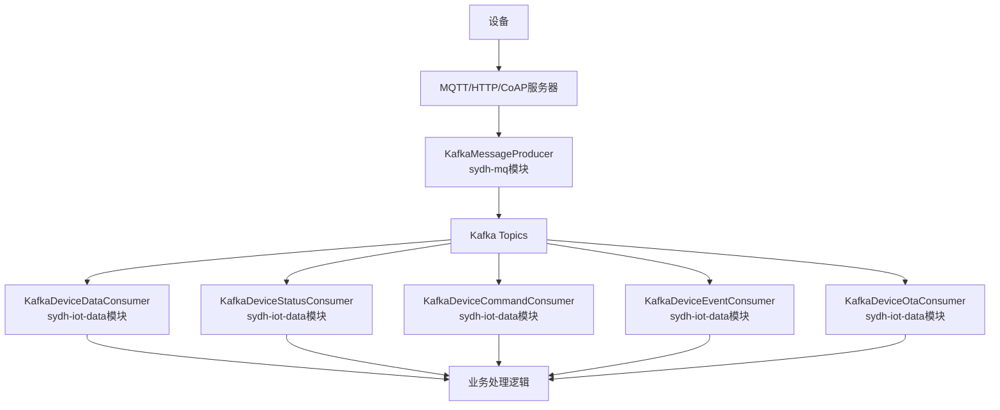

# Kafka消息分发架构总结

### 1. 架构重新设计

#### 模块职责重新划分

**sydh-mq模块** (消息基础设施)
- Kafka Topic配置 (`KafkaTopicConfig`)
- Kafka生产者 (`KafkaMessageProducer`) 
- 原有队列生产者 (`MessageProducer`)
- 消息路由和分发逻辑

**sydh-iot-data模块** (业务逻辑)
- Kafka消费者配置 (`KafkaConsumerConfig`)
- 各类Kafka消费者实现
- 设备消息业务处理
- 与现有业务逻辑集成

#### 依赖关系简化
```
原来: sydh-iot-data ↔ sydh-mq (循环依赖)
现在: sydh-iot-data → sydh-mq (单向依赖)
```

### 2. 实现组件

#### sydh-mq模块组件
```
├── config/
│   └── KafkaTopicConfig.java          # Topic自动创建配置
├── producer/
│   ├── KafkaMessageProducer.java      # Kafka消息生产者
│   └── MessageProducer.java           # 原有生产者接口
└── queue/                             # 保留原有队列实现
    ├── DeviceReportQueue.java
    └── ...
```

#### sydh-iot-data模块组件
```
├── config/
│   └── KafkaConsumerConfig.java       # 消费者配置
└── consumer/kafka/
    ├── KafkaDeviceDataConsumer.java   # 设备数据消费者
    ├── KafkaDeviceStatusConsumer.java # 设备状态消费者
    ├── KafkaDeviceCommandConsumer.java# 设备指令消费者
    ├── KafkaDeviceEventConsumer.java  # 设备事件消费者
    └── KafkaDeviceOtaConsumer.java    # OTA升级消费者
```

### 3. 消息流架构



## 配置要求

### 1. 依赖配置

#### sydh-mq/pom.xml
```xml
<dependencies>
    <!-- Spring Kafka -->
    <dependency>
        <groupId>org.springframework.kafka</groupId>
        <artifactId>spring-kafka</artifactId>
    </dependency>
    <dependency>
        <groupId>org.apache.kafka</groupId>
        <artifactId>kafka-clients</artifactId>
    </dependency>
    <!-- 其他基础依赖，不包含业务模块 -->
</dependencies>
```

#### sydh-iot-data/pom.xml
```xml
<dependencies>
    <!-- 现有依赖 -->
    <dependency>
        <groupId>com.sydh</groupId>
        <artifactId>sydh-mq</artifactId>
    </dependency>
    <!-- 新增Kafka支持 -->
    <dependency>
        <groupId>org.springframework.kafka</groupId>
        <artifactId>spring-kafka</artifactId>
    </dependency>
</dependencies>
```

### 2. 应用配置

#### application-dev.yml
```yaml
iot:
  message:
    mode: kafka                             # 切换到Kafka模式
  kafka:
    topics:
      device-data: "iot-device-data"        # 设备数据上报
      device-status: "iot-device-status"    # 设备状态变更
      device-commands: "iot-device-commands" # 设备指令下发
      device-events: "iot-device-events"    # 设备事件告警
      device-ota: "iot-device-ota"          # OTA升级消息
    partitions: 6                           # 每个Topic分区数
    replication-factor: 1                   # 副本因子

spring:
  kafka:
    bootstrap-servers: localhost:9092
    producer:
      key-serializer: org.apache.kafka.common.serialization.StringSerializer
      value-serializer: org.apache.kafka.common.serialization.StringSerializer
      batch-size: 16384
      buffer-memory: 33554432
      retries: 3
      acks: 1
      compression-type: gzip
      linger-ms: 5
    consumer:
      group-id: iot-device-consumer
      key-deserializer: org.apache.kafka.common.serialization.StringDeserializer
      value-deserializer: org.apache.kafka.common.serialization.StringDeserializer
      auto-offset-reset: latest
      enable-auto-commit: false
      max-poll-records: 100
      fetch-min-size: 1024
      fetch-max-wait: 500
    listener:
      ack-mode: manual_immediate
      concurrency: 3
      poll-timeout: 3000
```

## 性能优化

### 1. 分区策略
- **分区数量**: 6个分区适合50台设备
- **分区键**: 使用设备序列号确保消息顺序
- **Key格式**: `{deviceSN}:{messageType}:{timestamp}`

### 2. 生产者优化
- **批次处理**: 16KB批次大小
- **压缩**: gzip压缩减少网络传输
- **异步发送**: 5ms延迟聚合提高吞吐量

### 3. 消费者优化
- **并发处理**: 每Topic 3个消费者线程
- **批量消费**: 单次最多100条消息
- **手动提交**: 确保消息处理完成后提交

## 监控和运维

### 1. 关键指标
- 消息生产/消费速率
- 消费延迟监控
- 错误率统计
- 分区负载均衡

### 2. 消费者组
- `device-data-processor` - 设备数据处理
- `device-status-processor` - 设备状态处理
- `device-command-processor` - 设备指令处理
- `device-event-processor` - 设备事件处理
- `device-ota-processor` - OTA升级处理

## 扩展性

### 1. 设备规模扩展
| 设备数量 | 建议分区数 | 预期性能 |
|---------|-----------|----------|
| 50台    | 6分区     | 5K msg/s |
| 100台   | 12分区    | 10K msg/s |
| 500台   | 24分区    | 50K msg/s |

### 2. 生产环境建议
- 增加副本数到3
- 使用集群部署
- 配置跨数据中心复制

## 迁移计划

### 1. 平滑切换
```yaml
iot:
  message:
    mode: queue  # 开发阶段保持队列模式
```

### 2. 切换到Kafka
```yaml
iot:
  message:
    mode: kafka  # 生产环境切换到Kafka模式
```

### 3. 回滚方案
- 保留原有队列实现
- 支持运行时模式切换
- 零停机回滚能力

## 总结

通过重新设计模块架构，成功解决了循环依赖问题：

1. **问题解决**: 消除了模块间的循环依赖
2. **架构清晰**: 明确的职责划分和依赖方向
3. **性能提升**: 支持高并发消息处理
4. **易于维护**: 模块化设计便于后续扩展
5. **平滑迁移**: 支持队列和Kafka模式切换
